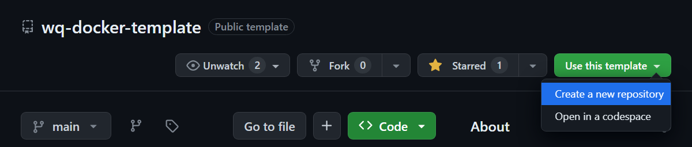
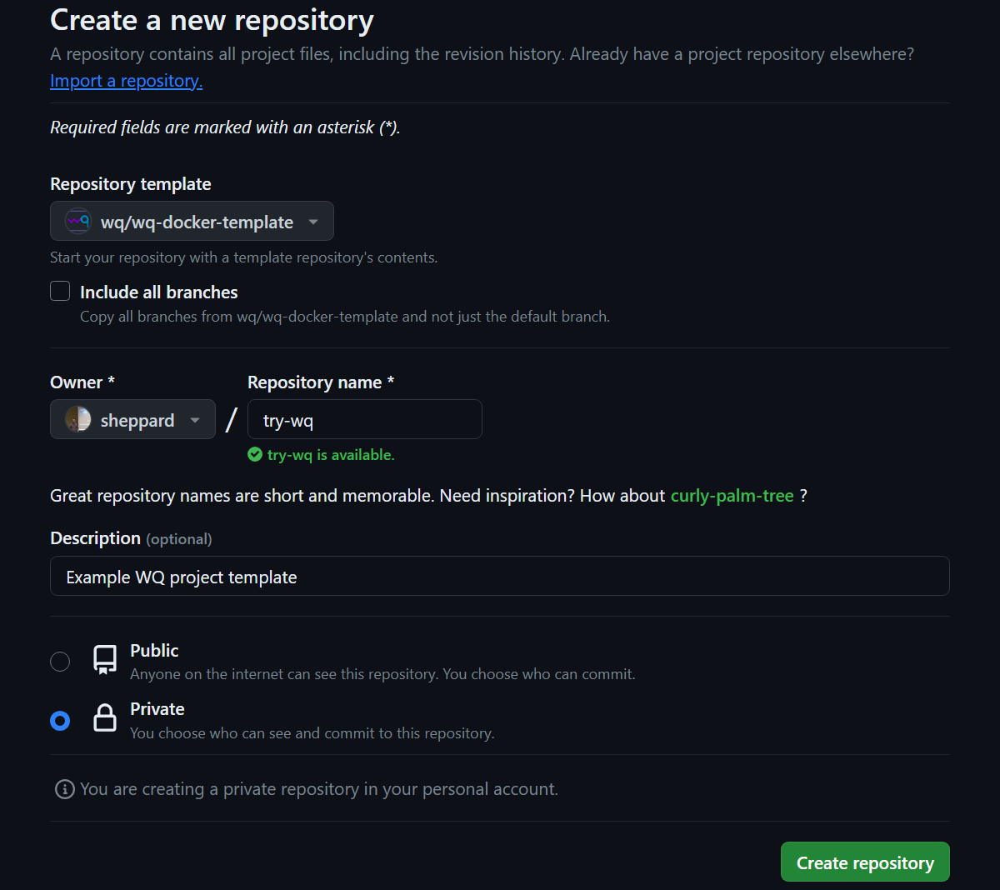
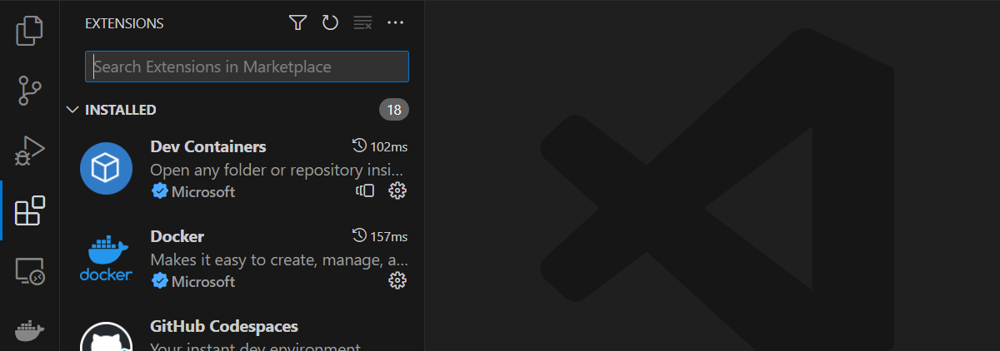
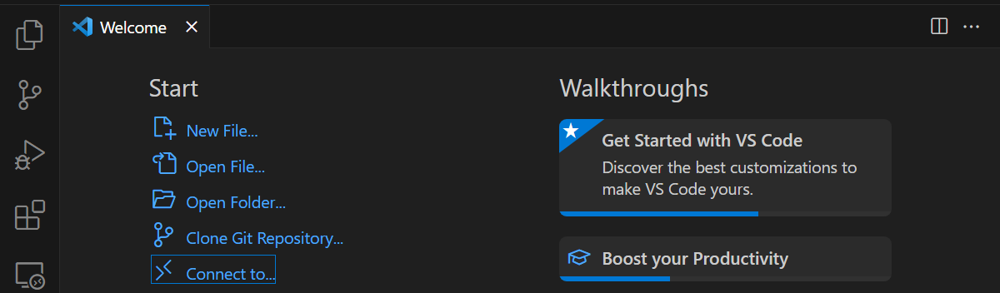
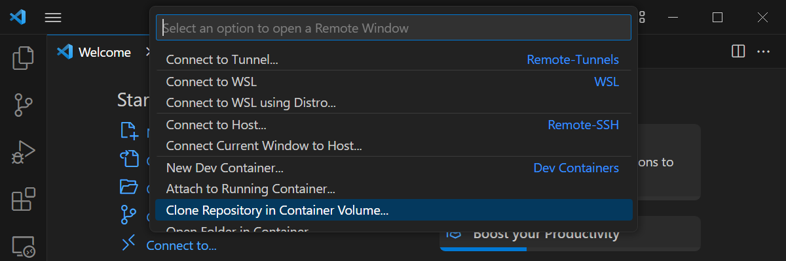
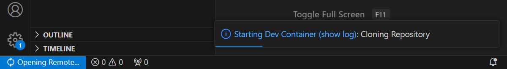
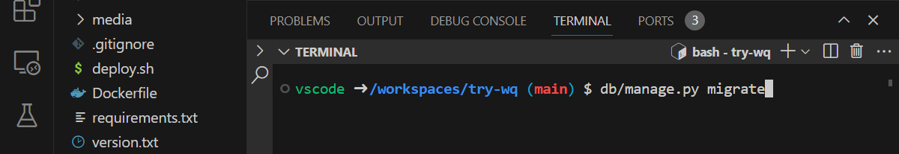
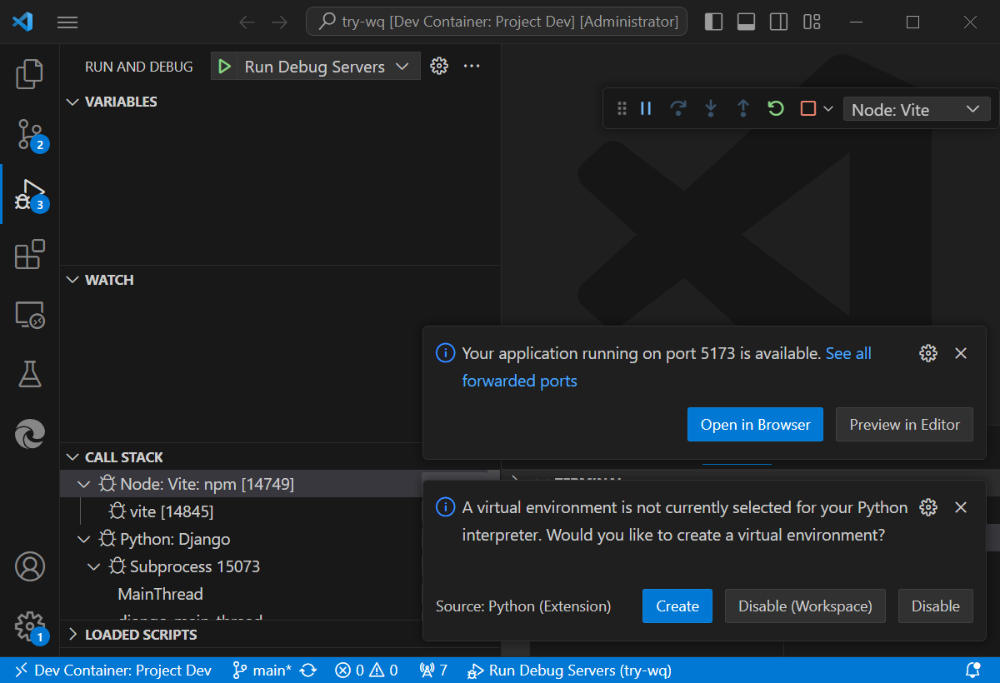
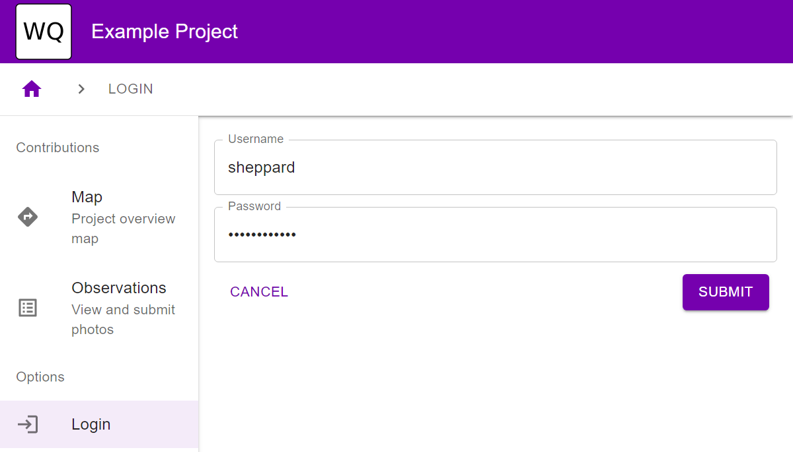

How To: Set up wq with Docker Desktop
========================================

The following steps should help you [install wq] and get a wq-powered web application running for development and testing via [Docker Desktop][docker].

> This configuration assumes Docker Desktop is installed and [WSL 2][wsl] enabled on your local machine.  If you do not have these running already, it may be easier to follow the [GitHub Codespaces][setup-codespaces] instructions instead.

* [Set up Dev Container](#set-up-dev-container)
* [Start Dev Servers](#start-dev-servers)
* [Next Steps](#next-steps)

## Set up Dev Container

1. Go to <https://github.com/wq/wq-docker-template>

2. Click "Use this template" -> "Create a new repository"


3. Specify a repository name, description, and access settings


4. Ensure that Docker Desktop is running

5. Open Visual Studio Code and ensure that the Dev Containers extension is installed.


6. Select "Connect To..." -> "Clone Repository in Container Volume..." -> "Clone a Repository from GitHub in a Container Volume"


> Note: Do not clone the repository directly with "Clone Git repository...".  It will probably work, but will be significantly slower since the workspace will be mounted as a Windows directory accessed from a Linux (WSL) container.  Using a container volume ensures the workspace filesystem is stored entirely in WSL.  (If you need to access the workspace directory from Windows, go to `\\wsl.localhost\docker-desktop-data\data\docker\volumes\` and look for the volume named after the cloned repository)

7. Select project you created in Step 3, then the main branch.  Wait a few minutes for the container to build.

> Once the container is built, it will load much faster next time you open the project.

## Start Dev Servers

8. Once the container is running, locate the Terminal.  If the container build log is still visible, you may need to close it and start a new terminal with "+".

In the Terminal, enter the following commands:
```bash
db/manage.py migrate
db/manage.py createsuperuser
```
When prompted, enter throwaway credentials since this is a dev instance.

9. Activate the "Run Debug Servers" command from the Run and Debug tab (or by pressing F5)

> Note: VS Code will ask if you want to open 5173 and/or 8000 in a regular browser window as they come up.  You can ignore these prompts as the debug browser will open automatically pointing to localhost:5173, and the vite configuration proxies API requests to localhost:8000 automatically.  You can also ignore the suggestion to create a virtual environment.

10. Wait for the debug browser to open automatically once Vite is ready on port 5173.

11. Confirm that you can log into the application using the credentials you entered in step 8.  If the screen is blank at first, refresh the application after Django (port 8000) comes up.


## Next Steps

You now have a working wq development environment running on your local machine!  At this point you can take any of the following steps:

 * Update the [config] settings to override the site title and theme
 * Describe the rest of [your data model][model]
 * Deploy the application to [Azure App Service][appservice] or [AWS App Runner][apprunner]

[install wq]: ../overview/setup.md
[docker]: https://www.docker.com/products/docker-desktop/
[wsl]: https://learn.microsoft.com/en-us/windows/wsl/
[setup-codespaces]: ./setup-wq-with-github-codespaces.md
[config]: ../config.md
[model]: ./describe-your-data-model.md
[appservice]: ./setup-wq-with-azure-app-service.md
[apprunner]: ./setup-wq-with-aws-app-runner.md