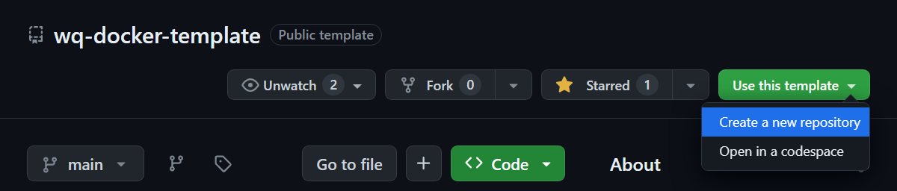
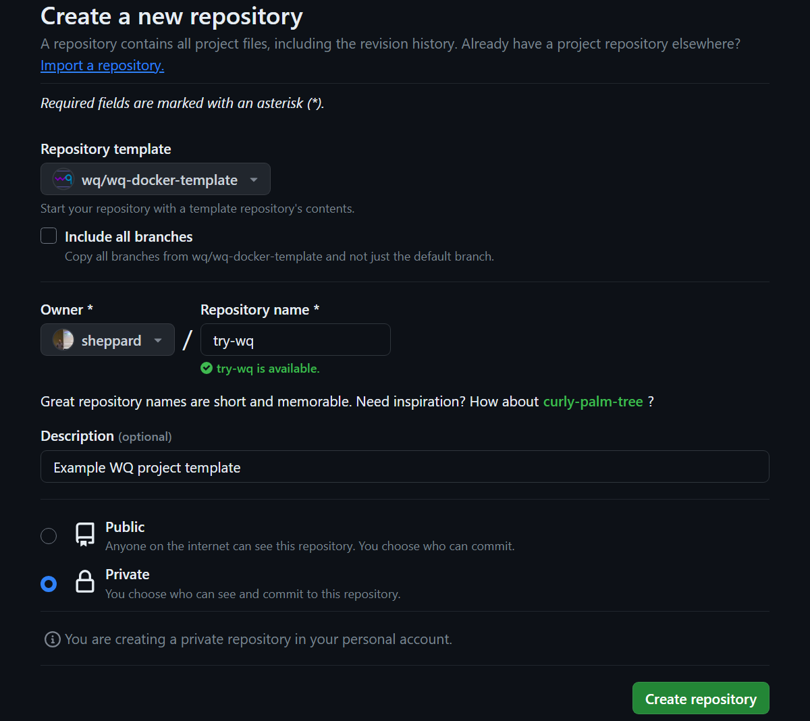
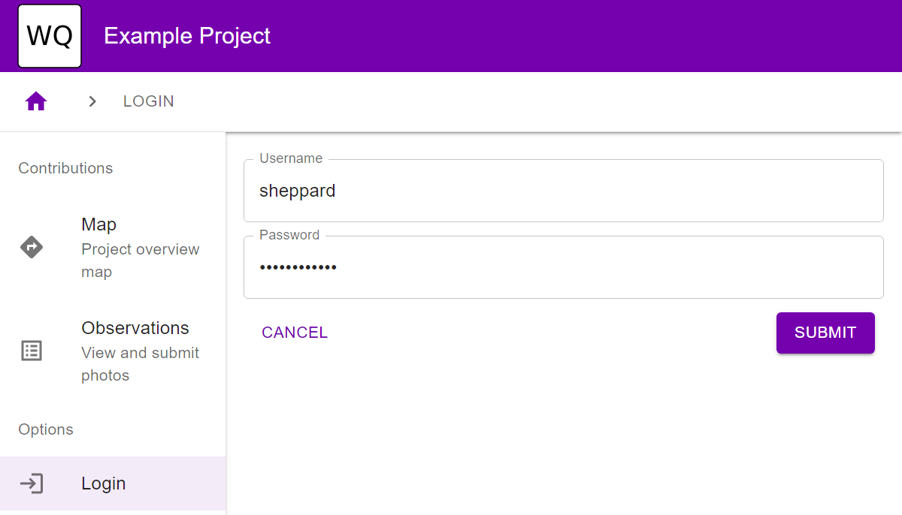

How To: Set up wq with GitHub Codespaces
========================================

The following steps should help you [install wq] and get a wq-powered web application running for development and testing via [GitHub Codespaces][codespaces].

> This is the recomended setup for new users because it doesn't require any software packages to be installed on your local computer.  However, note that GitHub Codespaces is a commercial product with a limited number of free hours.  If you would like a fully local development environment, follow the [Docker Desktop][setup-docker] instructions instead.

* [Set up Codespace](#set-up-codespace)
* [Start Dev Servers](#start-dev-servers)
* [Optional: Open in Visual Studio Code](#optional-open-in-visual-studio-code)
* [Next Steps](#next-steps)

## Set up Codespace

1. Go to <https://github.com/wq/wq-docker-template>

2. Click "Use this template" -> "Create a new repository"


3. Specify a repository name, description, and access settings


4. Within the new repository, select "Code" -> "Codespaces" -> "Create codespace on main"


5. Wait a few minutes for the container to build.

> Once the container is built, it will load much faster next time you open the project.

## Start Dev Servers

6. Within the Codespace, locate the Terminal...

... and enter the following commands:
```bash
db/manage.py migrate
db/manage.py createsuperuser
```
When prompted, enter throwaway credentials since this is a dev instance.

7. Activate the "Run Debug Servers" command from the Run and Debug tab (or by pressing F5)


8. Click on the link to open the application running on port 5173


> Note: You can ignore the error saying "Can't launch a browser in debug mode".  That said, you may want to open the codespace in Visual Studio Code for a better debugging experience (see below).  Also, there will be a prompt for a second application start up on port 8000.  That is the Django backend, which you won't usually need to interact with directly during development (since the included Vite configuration proxies API requests to Django).

9. Confirm that you can log into the application using the credentials you entered in step 6.  If the screen is blank, try refreshing after Django comes up on port 8000.


## Optional: Open in Visual Studio Code

For a better development experience, you can connect to the codespace from Visual Studio Code.

1. [Install Visual Studio Code](https://code.visualstudio.com/)
2. At <https://github.com/codespaces>, locate your existing codespace and stop it if it is still running.

> This step is necessary in order to prevent port forwarding issues when you connect to the codespace from your local machine.
3. Select "Open in Visual Studio Code" from the same menu.
4. You should now able to run the debug browser, and connect to ports in the codespace (including PostgreSQL) as if it was running on your local machine.

## Next Steps

You now have a working wq development environment running in the cloud!  At this point you can take any of the following steps:

 * Update the [config] settings to override the site title and theme
 * Describe the rest of [your data model][model]
 * Deploy the application to [Azure App Service][appservice] or [AWS App Runner][apprunner]

[install wq]: ../overview/setup.md
[codespaces]: https://github.com/features/codespaces
[setup-docker]: ./setup-wq-with-docker-desktop.md
[config]: ../config.md
[model]: ./describe-your-data-model.md
[appservice]: ./setup-wq-with-azure-app-service.md
[apprunner]: ./setup-wq-with-aws-app-runner.md